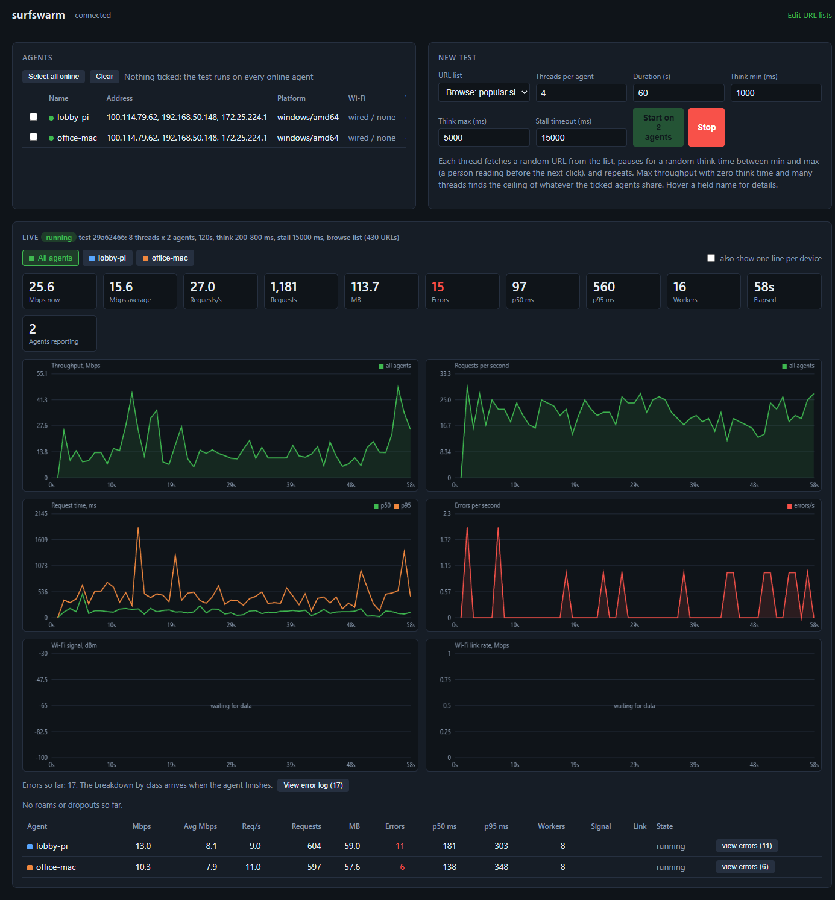
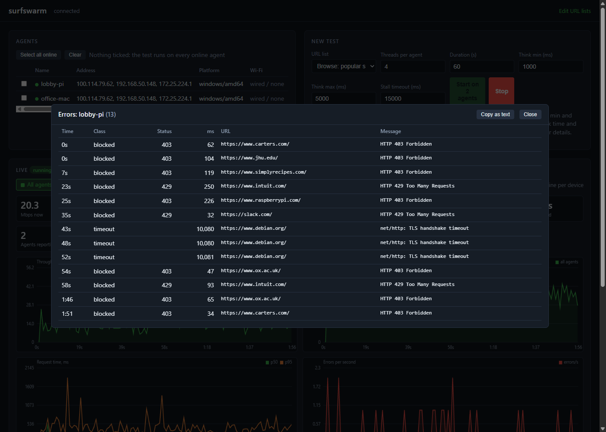
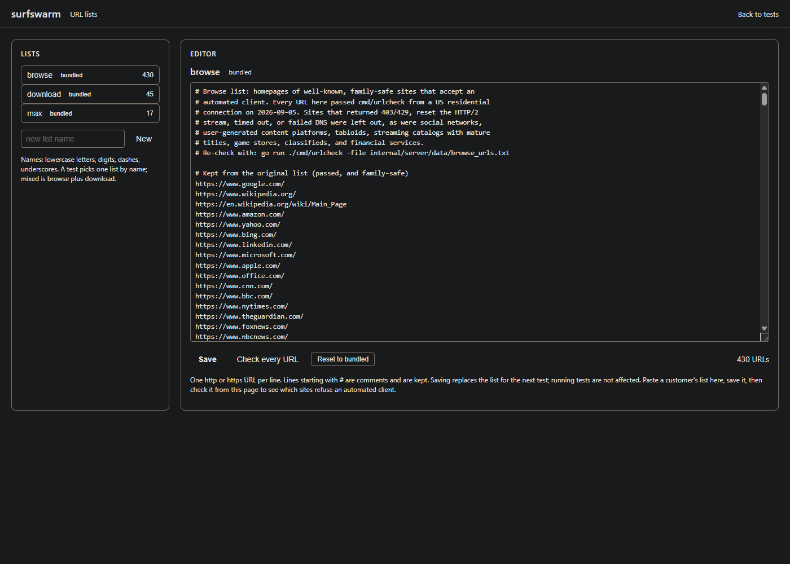
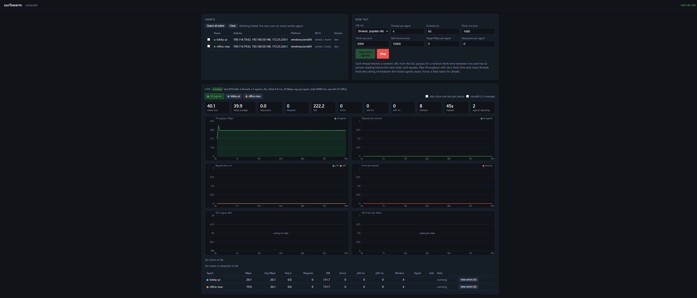

# surfswarm

Generate realistic web traffic from many small clients at once, so you can load a wireless access point the way a room full of people would and watch what it does.

A server shows every connected agent, lets you pick some or all of them, and starts a test: each agent runs N workers that fetch random sites from a list, pause, and fetch again. Throughput, request counts, errors, and latency stream back to the server twice a second.

Agents install as a boot-time service on Raspberry Pi and other Linux, macOS, and Windows. They report the Wi-Fi link they are on and keep a test running even if they lose the server mid-run. The server is a single binary with the web UI built in, or a Docker image. See Status at the end for what is done and what is planned.

## Screenshots







## Build

Requires Go 1.25 or newer.

```
go build ./cmd/server
go build ./cmd/agent
```

`./build.sh` cross-compiles both for Linux (amd64, arm64, armv7 for 32-bit Raspberry Pi OS), macOS (Intel and Apple Silicon), and Windows into `dist/`. No cgo, so every binary is static.

`go test ./...` runs the unit tests: protocol framing, error classification and the traffic engine against a local HTTP server, the Wi-Fi parsers against captured tool output, the list store, the aggregation math, and the UI password.

Binaries from the script carry a version like `0.1.0+20260905-205800`, the build time in UTC, plus the short git commit once the tree is under git. `surfswarm-agent -version` prints it, the agent logs it at startup, and the server shows it in the Version column of the agents table, so you can tell whether a device is running the build you just installed. Plain `go build` produces version `dev`.

## Run

Server:

```
./server -listen :8080 -token change-me -ui-password pick-something
```

Open http://localhost:8080/ for the UI. Agents connect to `ws://<server>:8080/agent`. The token is what agents must present; the UI password protects the pages and API with a browser login (any user name) and should be set whenever the server sits on a network you don't fully control, since anyone who can reach the port can otherwise start load on every agent. Every flag can also come from an environment variable: SURFSWARM_LISTEN, SURFSWARM_TOKEN, SURFSWARM_UI_PASSWORD, SURFSWARM_DATA.

Docker, for the server on a NAS or in a lab VM, and for a no-hardware demo:

```
docker compose up
```

That builds the image, starts the server on port 8080, and starts three agents in containers so the UI has something to show. Set SURFSWARM_TOKEN, SURFSWARM_UI_PASSWORD, and SURFSWARM_PORT (the host port) in a `.env` file to change the defaults. Container agents sit on the host's wired network, so they show no Wi-Fi link and their throughput reflects the host; real tests use agent binaries on real devices pointed at the server.

Agent, on each device you want pushing traffic:

```
./agent -server ws://192.168.1.10:8080/agent -token change-me -name pi-kitchen
```

The name defaults to the hostname. The agent stores a generated id under the user config directory so it keeps the same identity across restarts. It reconnects on its own with backoff, so running it under systemd or launchd with restart-on-exit gives you check-in on boot.

To try it on one machine, start the server and then two or three agents with different names, all pointing at `ws://127.0.0.1:8080/agent`.

## Install the agent as a service

The agent can install itself so it starts on boot and reconnects on its own. Run the install command as root or administrator: it copies the binary into place, writes a config file holding the server address and token, registers a service with the OS, and starts it. Running install again on a machine that already has it replaces the service, so upgrades are the same command with a newer binary.

On macOS and Linux, `scripts/install-agent.sh` wraps that in one step:

```
sudo ./install-agent.sh --server ws://192.168.1.10:8080/agent --token change-me --name pi-kitchen
```

It finds the binary next to itself or in `dist/` (or takes `--binary PATH`), makes it executable, clears the macOS quarantine flag, runs the install, then prints the service status, the installed version, and where the log is. A handy pattern for a fleet is a one-line wrapper per device with the server, token, and name baked in, so an update is: copy the new binary, run the wrapper with sudo.

### macOS

Use the arm64 build on Apple Silicon and amd64 on Intel. Copy it over, then on the Mac:

```
chmod +x /tmp/surfswarm-agent
sudo /tmp/surfswarm-agent install -server ws://192.168.1.10:8080/agent -token change-me -name macbook-seth
sudo surfswarm-agent status
```

That leaves you with:

- binary at /usr/local/bin/surfswarm-agent
- config at /etc/surfswarm/agent.json, mode 600 since it holds the token
- agent id under /Library/Application Support/surfswarm
- launchd daemon at /Library/LaunchDaemons/surfswarm-agent.plist with RunAtLoad and KeepAlive
- logs at /var/log/surfswarm-agent.out.log and /var/log/surfswarm-agent.err.log

Gatekeeper: the builds are not signed or notarized yet, so a binary that arrives through a browser download or AirDrop carries a quarantine flag and macOS refuses to run it with a dialog saying Apple could not verify it. Don't click Move to Trash. Either clear the flag from Terminal:

```
xattr -d com.apple.quarantine ~/Downloads/surfswarm-agent-darwin-arm64
xattr -l ~/Downloads/surfswarm-agent-darwin-arm64
```

The second command should print nothing once the flag is gone. Or, after the dialog has appeared once, open System Settings, go to Privacy & Security, scroll to the Security section, and click Open Anyway next to the message about the blocked file, then run it again.

Binaries copied with scp or curl don't carry the flag. The install command copies the binary to /usr/local/bin, and that copy is clean, so the daemon itself never trips Gatekeeper. Signed and notarized builds need an Apple Developer account and are on the roadmap.

The daemon runs as root. That is deliberate: reading Wi-Fi details such as signal, channel, and rate on current macOS needs root, and that is where the Wi-Fi column comes from.

### Linux, including Raspberry Pi

Same command with the matching build (arm64 for 64-bit Raspberry Pi OS, arm for 32-bit, amd64 for Ubuntu on x86):

```
chmod +x surfswarm-agent-linux-arm64
sudo ./surfswarm-agent-linux-arm64 install -server ws://192.168.1.10:8080/agent -token change-me -name pi-kitchen
```

Binary at /usr/local/bin/surfswarm-agent, config at /etc/surfswarm/agent.json, state in /var/lib/surfswarm, systemd unit surfswarm-agent with Restart=always. Logs: `journalctl -u surfswarm-agent -f`.

### Windows

From an administrator prompt:

```
surfswarm-agent-windows-amd64.exe install -server ws://192.168.1.10:8080/agent -token change-me -name win-laptop
```

Binary in C:\Program Files\surfswarm, config in C:\ProgramData\surfswarm\agent.json, log at C:\ProgramData\surfswarm\state\agent.log. It runs as a Windows service set to restart on failure.

### Managing it

```
surfswarm-agent status
surfswarm-agent stop
surfswarm-agent start
surfswarm-agent restart
surfswarm-agent uninstall
```

Uninstall removes the service and leaves the config and binary behind. Edit the config file and run restart to change the server address, token, or name.

## Start a test

From the UI: tick the agents you want (or none for all), pick a URL list, set threads, duration, and think time, press Start. Threads are simulated users per agent. Think time is the pause each thread takes between one request and the next, a random length between the min and max you set, standing in for a person reading a page before clicking again; zero on both turns the run into a throughput test. Hovering a field name in the form shows the same explanation. Select all online and Clear sit above the agents table for picking a set of devices quickly, and the Start button says how many agents it will hit. Choosing the download or max throughput list sets think time to zero and a longer stall timeout; max also sets 16 threads per agent.

From the API:

```
curl -s -X POST http://localhost:8080/api/tests \
  -H 'Content-Type: application/json' \
  -d '{"url_list":"browse","threads":4,"duration_s":60,"think_min_ms":1000,"think_max_ms":5000,"timeout_ms":15000}'
```

Other endpoints:

```
GET  /api/agents            every agent seen since the server started
GET  /api/tests             every test since the server started
GET  /api/tests/{id}        one test with per-agent results and the report history
GET  /api/tests/{id}/errors failed requests per agent (add ?agent=ID for one device)
POST /api/tests/{id}/stop   stop early
GET  /api/urls              every URL list's URLs, keyed by name
GET  /api/lists             list names with counts and whether they are bundled or edited
GET  /api/lists/{name}      one list's text with comments
PUT  /api/lists/{name}      save a list: body {"text": "..."}; 400 with per-line problems if invalid
DELETE /api/lists/{name}    reset a bundled list to its shipped version, or delete a custom one
POST /api/lists/{name}/check  start checking every URL in a list; GET the same path for progress and results
```

`agent_ids` in the create body restricts a test to specific agents; leave it out for all online agents. `url_list` is `browse` (default), `download`, `max`, `mixed`, or the name of any custom list. `rate_mbps` caps each agent's download rate and `requests_per_sec` switches to a fixed request cadence; see Steady load below. `timeout_ms` is a stall timeout: a request is abandoned when no bytes have arrived for that long, so big downloads on slow links are fine as long as data keeps flowing.

## URL lists

Three lists ship inside the server binary, in `internal/server/data/`.

The browse list holds about 430 homepages of well-known sites: reference and science, museums, kids and family brands, universities, government, health organizations and charities, technology companies, mainstream news, food, cars, retail chains, travel, and sports. Every entry passed the checker below from a US residential connection, and the list leaves out social networks, user-generated content platforms, tabloids, streaming catalogs with mature titles, game stores, classifieds, and financial services, so it stays suitable for networks with content filtering and for demos.

The download list holds about 45 test files of 10 MB to 100 MB that hosting providers and CDNs publish for bandwidth testing (Cloudflare, Hetzner, OVH, Tele2, ThinkBroadband, Vultr, Linode, CacheFly, Scaleway, WTNet), spread across US, European, and Asia-Pacific regions. They are filler bytes, not software. A few are plain HTTP on purpose so a test carries some unencrypted traffic.

The max throughput list is the subset of those that answer fastest from North America: Cloudflare's edge, CacheFly, the US and Toronto Linode regions, the US Vultr regions, and Hetzner's Oregon site, all 50 to 100 MB. Use it to find the ceiling of one access point or switch: tick only the agents behind it, pick the max list, and let the preset's 16 threads with zero think time do the rest. From elsewhere in the world, re-check it with urlcheck and swap in the closer regions from the download list.

On safety: the agent streams every response into a discard sink. Nothing it fetches is written to disk, opened, or executed, so a compromised site could not infect a client through this tool. The download entries were also checked for a binary content type and the expected size, and the browse entries are all established organizations. What this does not do is scan those sites for you on an ongoing basis; if you need that assurance, run the lists through your own URL reputation service before a customer engagement.

### Editing the lists

The Edit URL lists link in the header opens an editor. Pick a list, change the text (one URL per line, # for comments), and save; the next test that picks that list uses the new contents. Bundled lists can be edited and reset to their shipped version; custom lists can be added by name and deleted. A test picks any list by name, from the menu on the main page or as `url_list` in the API.

Check every URL runs the checker against the saved list from the server, shows progress, and lists each failure with its class, status, and message. Remove failing lines from editor then strips those URLs from the text so one more save gives you a clean list. This is the workflow for a customer's own list: paste, save, check, prune, save.

Edits are stored as text files under the server's data directory (`-data`, default `data` next to where the server runs), so they survive restarts and can be backed up or copied between servers.

### Checking the lists

Errors in a test are almost always sites refusing automated clients, not the network under test. To see which ones, fetch a whole list once the same way the agent does:

```
go run ./cmd/urlcheck -file internal/server/data/browse_urls.txt
```

```
go run ./cmd/urlcheck -file internal/server/data/download_urls.txt -max-bytes 2000000 -all
```

It prints a summary line and one line per failing URL with the class, status, time, size, content type, and the error text. `-all` lists every URL, `-max-bytes` stops reading each body after that many bytes so the download list checks quickly, and `-emit-ok` writes the passing URLs to a file for building a pruned list. Run it from the network you test on, since blocking varies by region and by how much traffic a site has seen from you.

## Steady load

The default shape is a closed loop: each thread fetches, pauses for a random think time, and fetches again. That is how people browse, and the aggregate is bursty by construction. Two fields on the form change the shape when you want a flat line.

Target Mbps per agent paces every download with a token bucket, so with the download or max list each agent streams at that rate no matter how fast the link is. Sixteen agents at 20 Mbps is a steady 320 Mbps through the access point, the way sixteen video streams would be. This is the setting for "can this AP hold N clients at X Mbps each".

Requests/s per agent starts a request on a fixed cadence (open loop) instead of waiting on think time, using up to the thread count at once. If every thread is busy when a slot comes due, the slot is skipped and counted, which tells you the device could not keep up with the rate you asked for.

Both can be combined. Worker starts are also staggered so a closed-loop test does not fire all its threads in lockstep, and the smooth checkbox above the charts applies a three-second moving average when you would rather read the trend than the half-second detail.



## What agents report about their Wi-Fi

Twice a second an agent reads its wireless link (less often on platforms where the read is slow) and sends it along: SSID, BSSID, band, channel and width, signal in dBm, noise where available, and the negotiated rate. Linux uses `iw`, which ships with Raspberry Pi OS. macOS uses `wdutil`, which needs root and is why the daemon runs as root; recent macOS versions hide the SSID and BSSID from processes without location access, so a Mac may report signal, channel, and rate without the network name, and without root it falls back to the slower `system_profiler`. Windows uses `netsh`, which reports signal as a percentage that is converted to an approximate dBm. A wired device simply shows no link. `surfswarm-agent wifi` prints exactly what a device would report and how long the read took, which is the first thing to run when the Wi-Fi column looks wrong.

The agents table shows the current link for each device. During a test, each report carries the reading, so the live view charts signal and link rate over time, and the server logs events when a device roams to another BSSID, loses or regains Wi-Fi, or drops and restores its control connection to the server. The events line under the charts lists them for the selected view.

## When an agent loses the server

The control connection usually rides on the same Wi-Fi being loaded, so it is expected to drop exactly when results matter. An agent keeps its test running through a disconnect, queues its reports (up to twenty minutes' worth), reconnects with backoff, and flushes the queue. The server fills in that device's history from the queued reports, notes the outage as an event, and waits up to ninety seconds past the test's end for stragglers before closing the test. Only the aggregate line has a gap for the seconds the server did not hear from the device.

## Reading the live view

The live panel shows one view at a time: every agent combined, or a single device. Click a device's button above the tiles, or its row in the table, to switch; click again to go back to all. The tiles give current and average Mbps, requests per second, totals, p50 and p95 request times, workers, and elapsed time for whichever view is selected.

Six charts follow: throughput, requests per second, request time with p50 and p95, errors per second, Wi-Fi signal, and Wi-Fi link rate. Hover anywhere over a chart to snap to the nearest sample and read its exact values; the readout follows the pointer and keeps updating while a test runs. The all-agents view charts the combined total as a single line. A checkbox above the tiles can add one thinner line per device on top of it, which is the quickest way to spot a device being starved while the others run fine; it is off by default. The error breakdown by class appears under the charts as agents finish.

Every failed request is logged with its time, URL, class, HTTP status, duration, and the error text. The view errors button next to a device in the results table, or under the charts for the selected view, opens that log; the all-agents version merges every device and labels each row. Agents send failures as they happen, so the log fills in live, and the server keeps the last 2,000 per device per test.

## How a test runs

1. Server sends `start_test` with the full spec and the chosen URL list to each agent.
2. Each agent starts N workers. A worker picks a random URL, sends a GET with browser-like headers, reads the whole body (counted as wire bytes, since we ask for gzip and do not decompress), sleeps for a random think time, and repeats. A request that goes quiet for longer than the stall timeout is dropped and counted as a timeout.
3. Twice a second each agent reports cumulative requests, bytes, and errors, plus that interval's Mbps and p50/p95 request time, and its current Wi-Fi reading.
4. The server sums the per-agent numbers twice a second into a tick, normalizing rates to per second, keeps the history, and pushes ticks and per-agent updates to every open browser tab.
5. When the duration ends (or stop is pressed) each agent sends a summary with average Mbps, overall percentiles, and an error breakdown by class: dns, connect, timeout, tls, blocked (403/429), http_4xx, http_5xx, read.

Test length, thread count, think time, stall timeout, and the URL list are all per test.

## Protocol

JSON frames over one websocket per agent. Every frame is `{"type": "...", "data": {...}}`. Types are in `internal/protocol/protocol.go`. Agents only accept `start_test`, `stop_test`, and `ping`; there is no way to run arbitrary commands on an agent.

## Status

Done:

- Agent: connect, hello, heartbeat, reconnect with backoff, persistent id, get mode traffic engine with per-request timing and error classes.
- Server: agent hub, one test at a time, aggregation twice a second, REST API, live websocket events, embedded UI with a throughput chart and per-agent table.
- Cross-compile script for Linux, macOS, and Windows.
- Agent installs itself as a launchd daemon, systemd unit, or Windows service, with an install script for macOS and Linux.
- Three verified URL lists (browse, download, max throughput), an editor for them with custom lists, and the urlcheck tool.
- Per-device views with six live charts, hover readouts, per-request error logs, and richer per-second aggregates.
- Wi-Fi telemetry from every agent, with roam and dropout events during a test.
- Tests keep running through a lost control connection; reports are queued and flushed on reconnect.
- UI password, Docker image and compose demo, unit tests.

Not yet:

- Persistence of test results. Lists survive restarts; results live in memory until the server restarts.
- Page mode (fetch a page plus its images and scripts).
- Local target endpoints on the server for LAN-only tests.
- TLS on the server itself; put it behind a reverse proxy for now.
- Packages (.deb, .rpm) and signed macOS builds.
- Results history page, export, side-by-side comparison of two tests.
